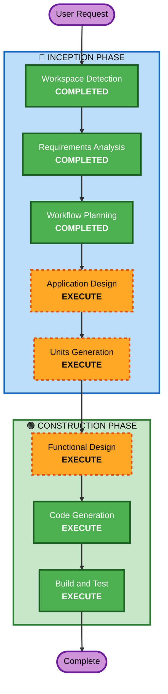

# Execution Plan — TCGT-QA-Panel

## Detailed Analysis Summary

### Change Impact Assessment
- **User-facing changes**: Sí — Panel completo nuevo para QA manuales
- **Structural changes**: Sí — Múltiples módulos Angular (dashboard, tests, ejecución, reportes, configuración)
- **Data model changes**: Sí — Modelos para tests, ejecuciones, historial, schedules, configuración
- **API changes**: No por ahora — Service layer con mocks, preparado para API futura
- **NFR impact**: Sí — Performance (carga < 3s), Docker deployment, PBT

### Risk Assessment
- **Risk Level**: Medium
- **Rollback Complexity**: Easy (proyecto nuevo, sin dependencias externas)
- **Testing Complexity**: Moderate (múltiples módulos, PBT para lógica de negocio)

---

## Workflow Visualization



### Text Alternative
```
INCEPTION PHASE:
  1. Workspace Detection .............. COMPLETED
  2. Reverse Engineering .............. SKIPPED (scaffold sin lógica)
  3. Requirements Analysis ............ COMPLETED
  4. User Stories ..................... SKIPPED (usuario no lo solicitó)
  5. Workflow Planning ................ COMPLETED
  6. Application Design .............. EXECUTE
  7. Units Generation ................ EXECUTE

CONSTRUCTION PHASE:
  8. Functional Design ............... EXECUTE (per-unit)
  9. NFR Requirements ................ SKIP
 10. NFR Design ...................... SKIP
 11. Infrastructure Design ........... SKIP
 12. Code Generation ................. EXECUTE (per-unit)
 13. Build and Test .................. EXECUTE
```

---

## Phases to Execute

### 🔵 INCEPTION PHASE
- [x] Workspace Detection (COMPLETED)
- [x] Reverse Engineering (SKIPPED — scaffold sin lógica de negocio)
- [x] Requirements Analysis (COMPLETED)
- [x] User Stories (SKIPPED — usuario no lo solicitó)
- [x] Workflow Planning (IN PROGRESS)
- [ ] Application Design - **EXECUTE**
  - **Rationale**: Proyecto nuevo con múltiples componentes, servicios y modelos de datos. Necesita diseño de componentes, service layer, y definición de interfaces.
- [ ] Units Generation - **EXECUTE**
  - **Rationale**: Sistema complejo que se beneficia de descomposición en unidades de trabajo paralelas (dashboard, test management, execution engine, reports, scheduling, configuration).

### 🟢 CONSTRUCTION PHASE
- [ ] Functional Design - **EXECUTE** (per-unit)
  - **Rationale**: Cada unidad tiene lógica de negocio que necesita diseño detallado (parsing de tests, gestión de data providers, scheduling logic).
- [ ] NFR Requirements - **SKIP**
  - **Rationale**: NFRs ya definidos en requirements.md. Tech stack ya decidido (Angular 21, Vitest, Docker). No hay decisiones pendientes.
- [ ] NFR Design - **SKIP**
  - **Rationale**: NFR Requirements skipped, no hay patrones NFR adicionales que incorporar.
- [ ] Infrastructure Design - **SKIP**
  - **Rationale**: Despliegue es Docker simple (Dockerfile + docker-compose). No hay cloud resources complejos ni infraestructura como código.
- [ ] Code Generation - **EXECUTE** (per-unit, ALWAYS)
  - **Rationale**: Implementación de todos los módulos del panel.
- [ ] Build and Test - **EXECUTE** (ALWAYS)
  - **Rationale**: Build, tests unitarios, PBT, y verificación de Docker.

### 🟡 OPERATIONS PHASE
- [ ] Operations - PLACEHOLDER

---

## Success Criteria
- **Primary Goal**: Panel funcional que permita a QA manuales gestionar y ejecutar automatizaciones de TCGT-QA
- **Key Deliverables**:
  - Dashboard con métricas y estado general
  - Módulo de gestión de tests (listar, filtrar, seleccionar)
  - Módulo de configuración de data providers
  - Módulo de ejecución (local + BrowserStack)
  - Módulo de reportes con integración Playwright HTML
  - Módulo de historial de ejecuciones
  - Módulo de scheduling
  - Módulo de configuración de ambientes
  - Dockerfile + docker-compose
  - Tests unitarios + PBT
- **Quality Gates**:
  - Build exitoso sin errores
  - Tests unitarios passing
  - Property-based tests passing
  - Docker build exitoso
  - Navegación funcional entre todos los módulos
